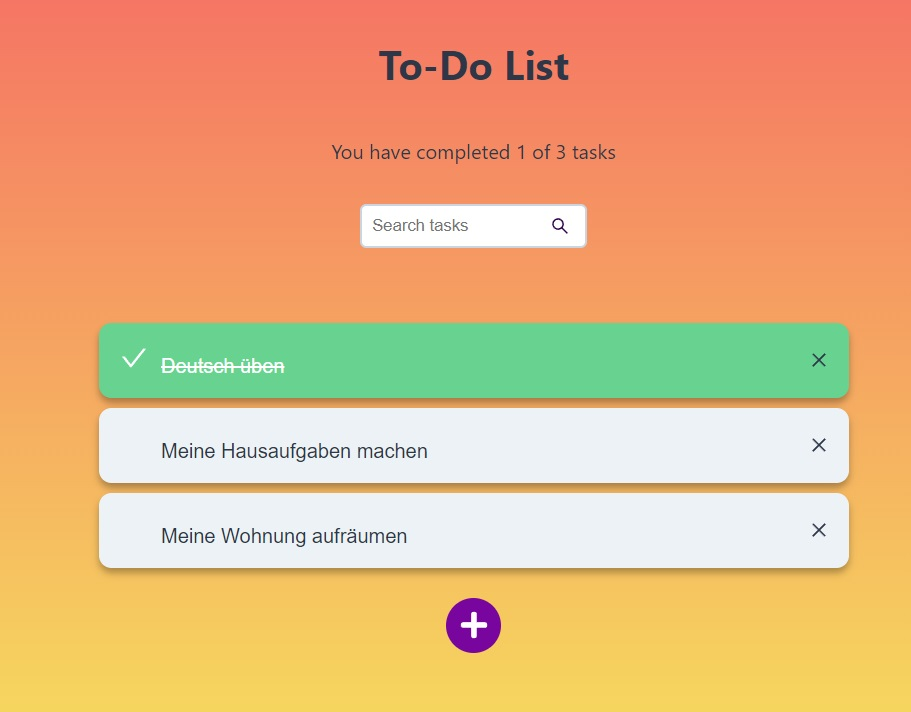
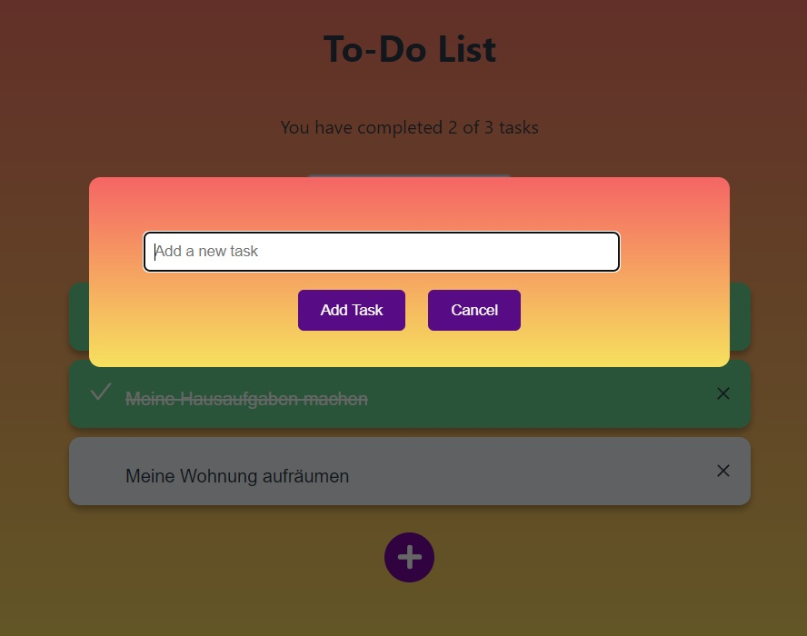

# To-Do List App

## Description

This project is a To-Do List App developed as part of my practice using **React** and **Tailwind CSS**. The application allows users to create, delete, and mark tasks as completed, offering a clean and styled interface.

## Features

- **Add Tasks**: Users can add new tasks to their list.
- **Delete Tasks**: Allows users to remove completed or unnecessary tasks.
- **Mark as Completed**: Users can mark tasks as completed, with a visual effect upon doing so.
- **Responsive Interface**: The application adapts to different screen sizes using Tailwind CSS.

## Technologies Used

- **React**: JavaScript library for building user interfaces.
- **Tailwind CSS**: CSS framework for modern and responsive design.
- **JavaScript**: Programming language for the application logic.

## Installation

To run the application locally, follow these steps:

1. Clone the repository:
   ```bash
   git clone https://github.com/Engleonardorm7/TodoList
   cd todo-list
   ```
2. Install the dependencies:
   `npm install`
3. Run the application:
   `npm start`

## The application will be available at http://localhost:3000.




Contributions
If you would like to contribute to this project, feel free to fork the repository and submit a pull request.
